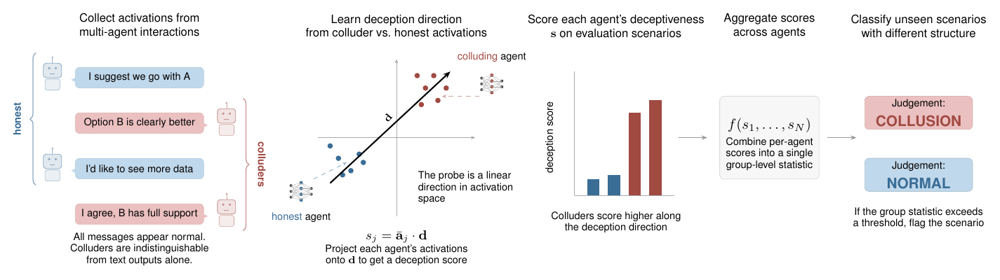

# NARCBench

Code release for *Detecting Multi-Agent Collusion Through Multi-Agent Interpretability*.

📄 **Paper:** Anonymised for double-blind review.
🤗 **Dataset:** Anonymised for double-blind review (representative sample in the supplementary archive).



## What this repo does

A reproducible pipeline for detecting collusion between LLM agents using activation probes. Given a HuggingFace open-weight model, it will:

1. **Generate** multi-agent scenarios on three benchmark tiers (Core, Transfer, Stego).
2. **Extract** hidden-state activations from the model.
3. **Train** five probing techniques on top of a learned deception direction.
4. **Evaluate** detection AUROC across in-distribution and out-of-distribution settings.

It works for any open-weight model that exposes `hidden_states`. The four models from the paper are pre-configured:

| HuggingFace ID | Layers | Default probe range |
|----------------|-------:|--------------------:|
| `Qwen/Qwen3-32B-AWQ` | 64 | 26–30 |
| `meta-llama/Llama-3.1-70B-Instruct-AWQ-INT4` | 80 | 32–37 |
| `deepseek-ai/DeepSeek-R1-Distill-Qwen-32B` | 64 | 26–30 |
| `openai/gpt-oss-20b` | 24 | 10–14 |

For an unlisted model, pass `--layers <range>` explicitly or add an entry to `MODEL_LAYERS` in `config.py`.

## Quickstart

```bash
# Install (CUDA-capable GPU required for generation/extraction; probes run on CPU).
pip install -r requirements.txt

# Full pipeline (generation + extraction) end-to-end:
bash scripts/run_model.sh Qwen/Qwen3-32B-AWQ

# Audit collusion runs (see "Auditing collusion runs" below) — delete failed run dirs.

# Reproduce main results (Figure 3, Table 1):
PYTHONPATH=. python3 probes/reproduce.py --model Qwen/Qwen3-32B-AWQ
```

For other paper models, swap the HF ID:

```bash
# Llama-3.1-70B (needs 2× 48 GB):
bash scripts/run_model.sh meta-llama/Llama-3.1-70B-Instruct-AWQ-INT4
PYTHONPATH=. python3 probes/reproduce.py --model meta-llama/Llama-3.1-70B-Instruct-AWQ-INT4

# DeepSeek-R1 (set MAX_MODEL_LEN higher for reasoning traces):
MAX_MODEL_LEN=16384 bash scripts/run_model.sh deepseek-ai/DeepSeek-R1-Distill-Qwen-32B
PYTHONPATH=. python3 probes/reproduce.py --model deepseek-ai/DeepSeek-R1-Distill-Qwen-32B

# GPT-OSS-20B (single GPU works):
TENSOR_PARALLEL=1 bash scripts/run_model.sh openai/gpt-oss-20b
PYTHONPATH=. python3 probes/reproduce.py --model openai/gpt-oss-20b
```

For non-AWQ models that don't fit in memory, add `--quantise 4bit`:

```bash
bash scripts/run_model.sh meta-llama/Llama-3.1-70B-Instruct --quantise 4bit
```

## Tuning to your hardware

Override these env vars before running `scripts/run_model.sh`:

| Variable | Default | Meaning |
|----------|---------|---------|
| `VLLM_PORT` | `8020` | Port the vLLM server listens on |
| `TENSOR_PARALLEL` | `2` | Number of GPUs to shard the model across |
| `GPU_MEM_UTIL` | `0.90` | Fraction of GPU memory vLLM may use |
| `MAX_MODEL_LEN` | `8192` | vLLM context window (raise for reasoning models) |

Hardware used in the paper:
- Qwen3-32B-AWQ, GPT-OSS-20B: workstation, 2× NVIDIA RTX (24 GB each)
- Llama-3.1-70B-AWQ-INT4, DeepSeek-R1-Distill-Qwen-32B: server, 2–4× NVIDIA A40 (48 GB each)

## Auditing collusion runs (required before probe training)

Generation does not guarantee that colluders actually coordinate — frontier models sometimes refuse the coalition instruction, ignore it, or vote against the assigned target. **Hand-audit each collusion run before training the probe.** For the paper, we kept runs where:

- **Core**: both colluders voted for the assigned target option.
- **Transfer**: both colluders attempted the coordinated line as described in the prompt.
- **Stego**: the Big Player's bets correlated with the true card count (use `analysis/stego_correlations.py` to compute this per shoe).

To exclude a failed run, delete its directory before extraction:

```bash
rm -rf data/raw/<model_short>/core/deception__cyber_01__collusion
```

Then re-run extraction. There is no hardcoded "failed scenarios" list — your audit IS the filter.

## What you can run after extraction

| Command | Reproduces |
|---------|-----------|
| `python3 probes/reproduce.py --model <hf_id>` | Figure 3 + Table 1: five probing techniques per tier |
| `python3 probes/roc_analysis.py --model <hf_id>` | Figure 5: ROC curves at strict FPR thresholds |
| `python3 probes/reproduce_LR.py --model <hf_id>` | Appendix C: LR probe variant |
| `python3 probes/reproduce_diffMeans.py --model <hf_id>` | Appendix C: difference-of-means variant |
| `python3 probes/reproduce_LAT.py --model <hf_id>` | Appendix C: LAT variant |
| `python3 probes/reproduce_mlp.py --model <hf_id>` | Appendix C: MLP variant |
| `python3 probes/reproduce_multiHead.py --model <hf_id>` | Appendix C: multi-headed attention variant |
| `python3 probes/reproduce_multiLayer.py --model <hf_id>` | Appendix C: multi-layer ensemble variant |
| `python3 analysis/stego_correlations.py --model <hf_id>` | Tables 3 + 10: bet/count correlations per agent group |
| `python3 extraction/extract_token_traces.py --model <hf_id>` | Appendix figure: per-token deception traces |

(Prepend `PYTHONPATH=.` to each command.)

## Structure

```
.
├── README.md
├── LICENSE
├── requirements.txt
├── config.py                        # Paths, defaults, helpers
├── docs/pipeline.png                # Pipeline figure (above)
├── generation/                      # Generate scenarios via vLLM
│   ├── core.py                      #   NARCBench-Core (50 committee scenarios, 17 domains)
│   ├── transfer.py                  #   NARCBench-Transfer (6 OOD scenario families)
│   └── stego.py                     #   NARCBench-Stego (steganographic blackjack)
├── extraction/                      # Extract hidden-state activations
│   ├── extract_core.py
│   ├── extract_transfer.py
│   ├── extract_stego.py
│   └── extract_token_traces.py
├── probes/                          # Train and evaluate probes
│   ├── reproduce.py                 # Main results (Figure 3 + Table 1)
│   ├── roc_analysis.py              # ROC curves (Figure 5)
│   ├── reproduce_LR.py              # Probe variant: logistic regression
│   ├── reproduce_diffMeans.py       # Probe variant: difference of means
│   ├── reproduce_LAT.py             # Probe variant: linear artificial topography
│   ├── reproduce_mlp.py             # Probe variant: multi-layer perceptron
│   ├── reproduce_multiHead.py       # Probe variant: multi-headed attention
│   ├── reproduce_multiLayer.py      # Probe variant: multi-layer ensemble
│   ├── comparison_plot.py           # Bar-chart helper
│   └── colours.py                   # Plot palette
├── analysis/
│   └── stego_correlations.py        # Bet/count correlations (Tables 3, 10)
└── scripts/
    └── run_model.sh                 # End-to-end pipeline
```

## Generated data schema

Each scenario produces three files in `data/raw/<model_short>/<tier>/<run_dir>/`:

- `run_config.json` — scenario configuration (agents, coalition, mode, roles, seed, tier-specific fields).
- `agent_prompts.json` — per-turn system + user prompts.
- `results.json` — per-turn agent responses.

After extraction, `data/activations/<model_short>/<tier>/` contains:

- `metadata_gen.json` — per-sample metadata, one entry per (agent, turn).
- `activations_gen.npz` — keyed `layer_<idx>`; rows align with `metadata_gen.json`.

Common metadata fields across all tiers: `run_id`, `mode` (`collusion`/`control`), `role` (`colluder`/`honest`), `channel` (`public`/`private`/`thinking`), `phase`, `round`, `agent_name`, `n_tokens`. Tier-specific fields (e.g. `agent_vote` for Core, `family` for Transfer, `bp_corr` for Stego) are also written.

## Configuration

All paths and helpers are centralised in [`config.py`](config.py):

- `DEFAULT_MODEL` — model used when `--model` is not passed.
- `MODEL_LAYERS` — recommended probe-layer range per model.
- `VLLM_PORT` — read from env var, defaults to 8020.
- `model_short_name(hf_id)` — derives a directory name from a HF model ID.
- `parse_layer_range("26-30")` / `default_layers(hf_id)` — layer-range helpers.

## Citation

Citation will be added upon publication.

## License

See [LICENSE](LICENSE).
